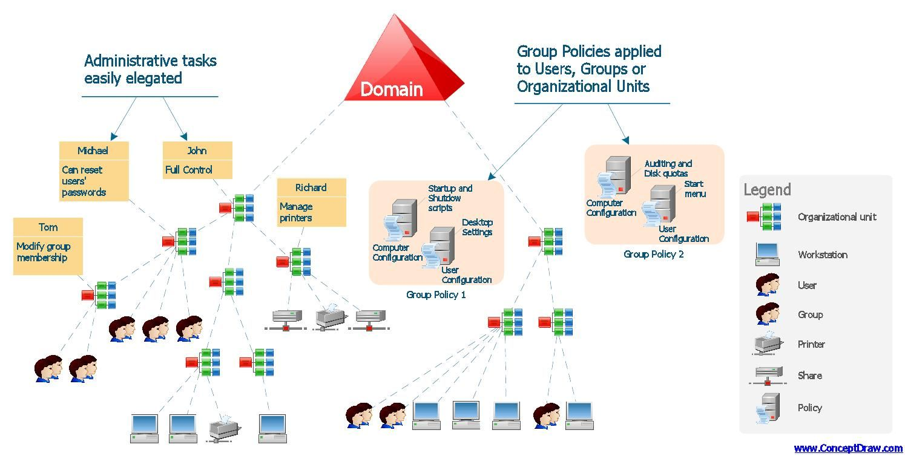

# 6.1.1 Introduction to Active Directory (AD)

## **Active Directory Overview**

<figure><figcaption></figcaption></figure>

### What is Active Directory (AD)? 

[**Active Directory**](https://learn.microsoft.com/en-us/windows-server/identity/ad-ds/get-started/virtual-dc/active-directory-domain-services-overview) **(AD)** is directory service developed by Microsoft to manage Windows domain networks and it is the most commonly used indentity management service in the world (95% of companies use it),

Active Directory is like a phone book that stores all kinds of informations related to different kind of objects, such as: computers, users, printers, etc. In this case, we can store info regarding:

* **Windows User**: Account Info, Privileges, Profiles, Policy;
* **Windows Servers:** Managament Profile, Network Information, Printers, File Shares, Policy;
* **Windows Clients**: Managament Profile, Network Information, Policy;
* Network Devices: Configuration, Quality of Service Policy, Security Policy;
* **Firewall Services**: Configuration, VPN Policy, Security Policy;
* **Applications**: Server Configuration, Single Sign-on, Application Specific Directory Information;
* **E-Mail Servers**: Mailbox Info, Address Book;
* **Other NDS**: User Registry, Security Policy.

All these info can be allocated throughout multiple location and AD permits centralization with: Manageability, Security and Interoperability.

It permits the authentication of computers in the network using relative credentials via Kerberos tickets methodology.

***

<figure><figcaption>
<a href="https://www.how2shout.com/wp-content/uploads/2019/01/Active-DirectoryAD-service-in-Microsoft-Windows-Server.jpg">https://www.how2shout.com/wp-content/uploads/2019/01/Active-DirectoryAD-service-in-Microsoft-Windows-Server.jpg</a>
</figcaption></figure>

## **Active Directory Components**

1. **Domains:**
   * Logical grouping of network objects (e.g., users, computers) managed as a single unit. Domains share security policies and directory databases.
2. **Domain Controllers (DCs):**
   * Servers responsible for authenticating logins and enforcing security policies.
   * Hold a copy of the AD database for redundancy and synchronization.
3. **Forests and Trees:**
   * A **forest** is the top-level container housing multiple domains that share a schema and configuration.
   * Domains within a forest are structured as **trees**, connected hierarchically for trust and resource access.
4. **Organizational Units (OUs):**
   * Logical containers within a domain for organizing objects like users, groups, and computers.
   * Facilitate delegation of administrative responsibilities and targeted GPO applications.
5. **Global Catalog (GC):**
   * A partial, read-only copy of the entire forest's objects.
   * Speeds up cross-domain queries.
6. **Trust Relationships:**
   * Define how domains within a forest or between forests share authentication and authorization information.
   * Types: One-way, two-way, transitive, or non-transitive.

***

## **Managing Networks with AD**

**Small Networks:**

In networks with fewer than 10 devices:

* Administration is manual and direct.
* Each system requires individual configuration and troubleshooting.

**Enterprise Networks:**

In larger organizations like "Foo Bank Inc." with 100+ devices:

* Manual management is infeasible.
* AD centralizes all tasks, from user account management to software updates, ensuring scalability and efficiency.

***

## **Authentication in AD**

1. **Kerberos Protocol:**
   * The default and secure method of authentication.
   * Employs ticket-based mechanisms:
     * **Ticket Granting Ticket (TGT):** Central to Single Sign-On (SSO).
     * Features: Mutual authentication, reduced credential exposure.
2. **NTLM Protocol:**
   * Legacy protocol for older systems.
   * Simpler but prone to vulnerabilities like Pass-the-Hash (PtH).

***

## **Users, Groups, and Computers in AD**

1. **Domain Users:**
   * Represent individuals with unique credentials for accessing resources.
   * Attributes like job title and department can be tied to accounts.
2. **Groups:**
   * **Security Groups:** Assign permissions for resource access.
   * **Distribution Groups:** Facilitate email distribution without security functions.
3. **Computers:**
   * Represent devices joined to the domain.
   * Have unique computer accounts for resource authentication.
